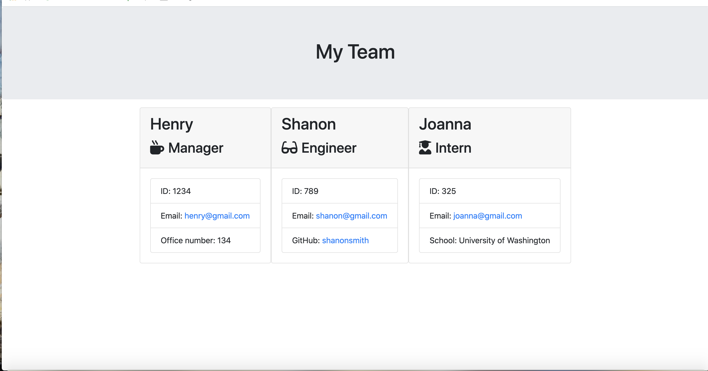

# Employee Summary

This application enables the user to create a list of employees which includes the employee name, id, email, and job role. Then based on the employee's role it will ask for either their current school, office number or github page.

## Table of Contents 

- [Technologies](#tech)
- [Instalation](#install)
- [Usage](#output)
- [Contribute](#contribute)
- [Questions](#email)
- [License](#license)

### Technologies

 The technologies utilized in this application are as follows: inquirer, path and fs, and Javascript, Node, Inquirer, Path and fs.

### Instalation

 To run this application successfully follow these steps:
  1. Install [Employee-Summary-](https://erinmarie84@github.io/Employee-Summary-/) to your local drive via terminal/GitBash. This will install the package.json file which contains a list of all the dependencies for this application. 

  2. Verify that node is installed on your computer by typing 'node' in your terminal/GitBash. If it returns
    >Welcome to Node.js V12.14.1 (or higher)
    >
    >Type '.help' for more information.

    Node.js is installed on your computer.
  3. Type 'npm install' in your terminal to install the dependencies. 

### Usage

 The purpose of this program is to solve Enables an employer to easily keep track of their existing employees. The following is the expected output of the application: The application goes through a series of questions regarding an employee and will create a profile of that employee on the web browser

### Contribute
 
 Contrubutions are to this application are welcome to imporve it's functionality. If you would like to contribute to this application please contact me at e_marie84@ymail.com

### Questions

 Any questions and/or comments are welcome. Please contact me at e_marie84@ymail.com or visit my [Github Profile](https://github.com/erinmarie84)

 ### License

 Licensed under the MIT license. 
